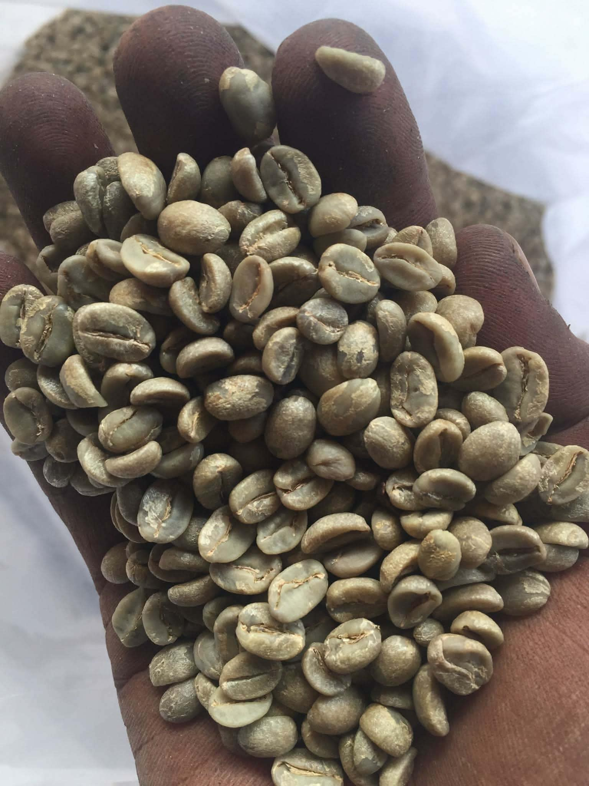
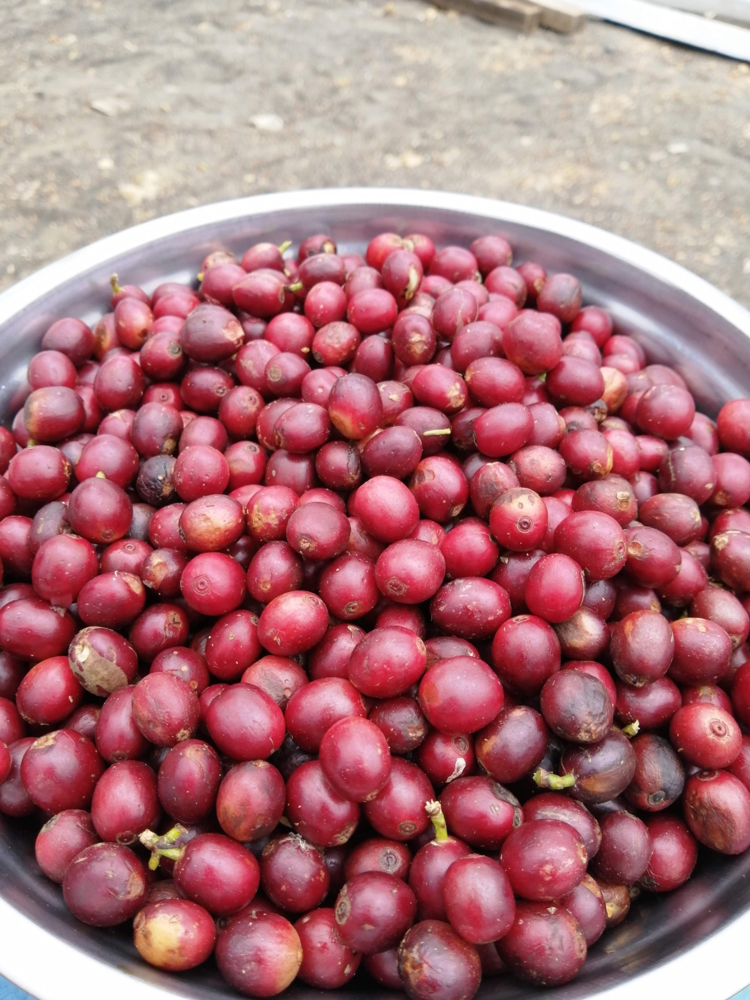
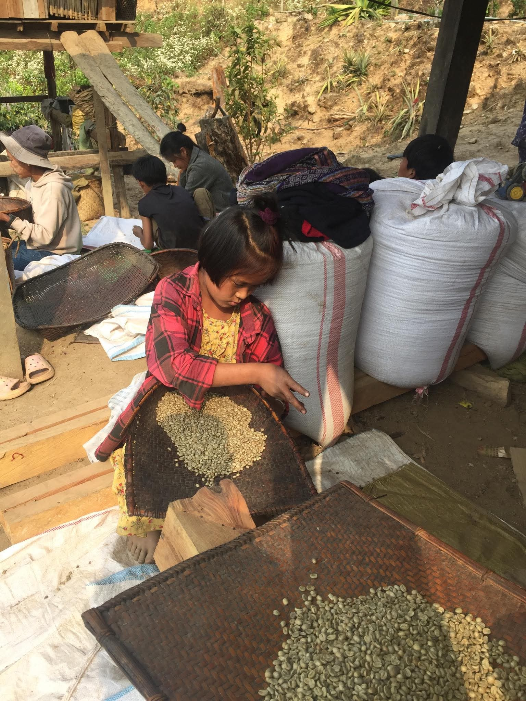

[index.html](https://github.com/user-attachments/files/28341934/index.html)
<!DOCTYPE html>
<html lang="ja">
<head>
    <meta charset="UTF-8">
    <meta name="viewport" content="width=device-width, initial-scale=1.0">
    <title>FUTURE CIRCULATION Co. | 一杯のコーヒーから、社会と未来の循環を。</title>
    
    <!-- Google Fonts: Cormorant Garamond & Noto Sans JP -->
    <link rel="preconnect" href="https://fonts.googleapis.com">
    <link rel="preconnect" href="https://fonts.gstatic.com" crossorigin>
    <link href="https://fonts.googleapis.com/css2?family=Cormorant+Garamond:ital,wght@0,300;0,400;0,500;0,600;1,400&family=Noto+Sans+JP:wght@300;400;500;700&display=swap" rel="stylesheet">
    
    <!-- Tailwind CSS -->
    
    
    <!-- Custom Tailwind Configuration for Premium Brand Identity -->
    

    

    <!-- Animation & Smooth Scroll Engine Setup -->
    
    
    
    
</head>
<body class="font-jp overflow-x-hidden">

    <!-- Screen Transition Preloader -->
    

        

            <h2 class="font-en text-2xl md:text-4xl font-light tracking-[0.25em] uppercase text-coffeeText mb-4 overflow-hidden">
                FUTURE CIRCULATION
            </h2>
            

            
Social Coffee Enterprise

        

    

    

    <!-- Interactive 3D Fluid Particles Background -->
    <canvas id="webgl-canvas" class="fixed inset-0 w-full h-full z-0 pointer-events-none opacity-50"></canvas>

    <!-- Global Corporate Header -->
    <header class="fixed top-0 left-0 w-full px-6 py-6 md:px-12 md:py-8 flex justify-between items-center z-50 mix-blend-difference">
        

            <a href="#" class="font-en text-base md:text-lg font-medium tracking-[0.2em] text-coffeeText uppercase transition-premium hover:text-coffeeAccent">
                FUTURE CIRCULATION Co.
            </a>
            ミャンマーコーヒー＆ソーシャルアクション
        

        
        <nav class="hidden lg:flex items-center gap-10 text-[10px] tracking-[0.25em] text-coffeeText uppercase font-medium">
            <a href="#about" class="relative hover:text-coffeeAccent transition-colors">ABOUT</a>
            <a href="#coffee" class="relative hover:text-coffeeAccent transition-colors">OUR COFFEE</a>
            <a href="#products" class="relative hover:text-coffeeAccent transition-colors">LINEUP</a>
            <a href="#circulation" class="relative hover:text-coffeeAccent transition-colors">CIRCULATION</a>
        </nav>

        <a href="#contact" class="border border-coffeeText/15 hover:border-coffeeAccent px-6 py-2.5 rounded-full text-[10px] tracking-[0.2em] text-coffeeText hover:text-coffeeBg hover:bg-coffeeAccent uppercase transition-premium">
            CONTACT
        </a>
    </header>

    <!-- Smooth Scroll Container (Lenis) -->
    

        

            <!-- 1. HIGH-END BRAND & VISION HERO -->
            <section class="min-h-screen flex flex-col justify-center items-center px-6 py-24 text-center relative">
                

                    
                        Social & Sustainable Coffee Project
                    
                    <h1 class="font-en text-4xl sm:text-6xl md:text-[6.5rem] font-light leading-none tracking-tight mb-8">
                        Future
                        Circulation
                    </h1>
                    <h2 class="font-jp text-base md:text-xl font-light tracking-[0.25em] leading-relaxed mb-12 max-w-3xl mx-auto text-coffeeText/90">
                        一杯のコーヒーから、社会と未来の循環を。
                    </h2>
                    

                    
                    

                        

                            FUTURE CIRCULATIONは、ミャンマー山岳地域が育む最高品質のコーヒーと現地独自の日常文化を通じ、 
                            企業のソーシャルアクション（ESG/SDGs）と生活者を結ぶパートナーシップブランドです。
                        

                        

                            単なる消費に留まらない「美しい循環」の物語を、高付加価値な体験として編集しお届けします。
                        

                    

                    

                        <a href="https://myanmar.shopselect.net" target="_blank" rel="noopener noreferrer" class="px-8 py-4 bg-coffeeText text-coffeeBg hover:bg-coffeeAccent hover:text-coffeeBg font-en text-[11px] tracking-[0.2em] uppercase rounded-full transition-premium font-semibold shadow-xl">
                            ONLINE STORE ↗
                        </a>
                        <a href="#about" class="px-8 py-4 bg-transparent border border-coffeeText/20 hover:border-coffeeAccent text-coffeeText hover:text-coffeeAccent font-en text-[11px] tracking-[0.2em] uppercase rounded-full transition-premium">
                            LEARN MORE
                        </a>
                    

                

                
                <!-- Pure Interactive Scroll Down Line -->
                <a href="#about" class="absolute bottom-8 left-1/2 -translate-x-1/2 flex flex-col items-center gap-3 opacity-50 hover:opacity-100 transition-opacity">
                    Scroll Down
                    

                </a>
            </section>
            
            

            <!-- 2. CORPORATE PURPOSE & MISSION (Featuring "green_beans.jpg") -->
            <section id="about" class="py-24 md:py-40 px-6 md:px-12 max-w-7xl mx-auto">
                

                    
                    <!-- Left: Raw Coffee Beans in Hands -->
                    

                        

                            
                            
                            

                                PARTNERSHIP
                                信頼を紡ぐ、手の中の原石
                            

                        

                    

                    <!-- Right: Corporate Narrative -->
                    

                        

                            OUR PURPOSE
                            <h2 class="font-jp text-3xl md:text-4xl font-light leading-snug tracking-wider text-coffeeText">
                                一方的な支援ではない、 共創される価値。
                            </h2>
                        

                        

                            

                                近年、企業に強く求められている「持続可能な社会への貢献」と「本質的なストーリーテリング」。 
                                私たちは、単に寄付を募るような一過性の慈善活動ではなく、お互いを尊び、対等な経済活動の中で社会課題を解決していく<strong>「CSV (Creating Shared Value: 共通価値の創造)」</strong>を体現しています。
                            

                            

                                ミャンマーの山岳地帯にある豊かな生態系。そこで生きる人々の確かな手仕事。 
                                私たちはそれらを最高のクオリティに磨き上げ、日本の生活者や先進企業に向けて再編集したギフト・体験としてお届けします。
                            

                        

                        <!-- Mini Corporate Trust Section -->
                        

                            <h3 class="font-jp text-base tracking-widest font-normal text-coffeeAccent">
                                企業としてのコミットメント
                            </h3>
                            

                                当プロジェクトは、現地の生産地コミュニティと直接取引（ダイレクトトレード）を行い、適正価格での安定買い取りを通じて、持続可能な生活基盤の維持と現地の子どもたちへの教育支援を同時に実現しています。
                            

                            
                            

                                

                                    <h4 class="font-jp text-xs font-semibold text-coffeeText tracking-widest mb-1">01. 対等なパートナーシップ</h4>
                                    
搾取のない公正な取引（フェアトレード以上のコミット）を継続しています。

                                

                                

                                    <h4 class="font-jp text-xs font-semibold text-coffeeText tracking-widest mb-1">02. 確かな教育還元</h4>
                                    
収益の一部は、現地の持続可能な学校教育・環境整備に直結して活用されます。

                                

                            

                        

                    

                

            </section>

            <!-- 3. PRODUCT STORY: OUR COFFEE (Featuring "coffee_cherry.jpg") -->
            <section id="coffee" class="py-24 md:py-40 bg-coffeeCard/40 border-y border-white/5">
                

                    

                        
                        <!-- Left: Editorial Content -->
                        

                            

                                OUR COFFEE
                                <h2 class="font-jp text-3xl md:text-4xl font-light leading-snug tracking-wider text-coffeeText">
                                    天空の農園から生まれる、 完熟の恵み。
                                </h2>
                            

                            

                                

                                    ミャンマーの標高1500メートルを超える雲海に抱かれた山岳エリア。昼夜の極端な寒暖差と、有機的な土壌が育む特別なアラビカ豆。
                                

                                

                                    私たちが扱うコーヒーは、一粒一粒を生産者が目で確認しながら、完全に熟しきった真紅のチェリーだけを手摘みしたものです。それにより、<strong>えぐみのない、澄み切ったフルーティーな酸味と、キャラメルのような深い余韻</strong>が特徴となっています。
                                

                            

                            <!-- Quality Statement for Enterprises -->
                            

                                <h3 class="font-jp text-sm tracking-widest font-normal text-coffeeAccent">
                                    妥協のないクオリティ管理
                                </h3>
                                

                                    企業のノベルティや特別な社内ギフト、VIP顧客向けの手土産としても十分な満足をお届けできるよう、輸入ロットごとの厳格な品質検査とフレッシュな国内焙煎にこだわっています。ただの「エシカル（社会配慮）」に留まらず、純粋に「驚くほど美味しい」という体験をお約束します。
                                

                            

                        

                        <!-- Right: Harvest Cherries Image -->
                        

                            

                                
                                
                                

                                    HARVEST
                                    宝石のように選別された完熟チェリー
                                

                            

                        

                    

                

            </section>

            <!-- 4. SIGNATURE LINEUP (EC Direct Connect & Clean B2B Flow) -->
            <section id="products" class="py-24 md:py-40 px-6 md:px-12 max-w-5xl mx-auto">
                

                    PRODUCT PORTFOLIO
                    <h2 class="font-jp text-2xl md:text-3xl font-light tracking-[0.2em] text-coffeeText">プロダクトラインナップ</h2>
                

                <!-- Accordion Interface (Award-Winning UX Vibe) -->
                

                    
                    <!-- PRODUCT 01: ENTRY LINE (Linked to BASE EC) -->
                    

                        

                            

                                01
                                

                                    <h3 class="font-en text-lg md:text-2xl tracking-wider text-coffeeText group-hover:text-coffeeAccent transition-colors">ENTRY LINE / SINGLE DRIP BAG</h3>
                                    
日常に寄り添う、手軽で奥深い一杯

                                

                            

                            

                                
                                    GO TO STORE 
                                    →
                                
                            

                        

                        
                        

                            

                                

                                    ミャンマーコーヒー本来の澄んだ美味しさと、現地の美しい風土を手軽にお愉しみいただけるエントリーコレクション。ご自宅用やカジュアルなプチギフトに最適です。
                                

                                

                                    

                                        
パッケージ内容

                                        ドリップバッグ・ストーリーカード
                                    

                                    <a href="https://myanmar.shopselect.net" target="_blank" rel="noopener noreferrer" class="inline-block w-full text-center py-3 bg-coffeeAccent/10 hover:bg-coffeeAccent text-coffeeAccent hover:text-coffeeBg text-xs font-en tracking-[0.2em] rounded uppercase transition-premium font-semibold">
                                        オンラインショップで購入する ↗
                                    </a>
                                

                            

                        

                    

                    <!-- PRODUCT 02: HANDKERCHIEF GIFT (Linked to BASE EC) -->
                    

                        

                            

                                02
                                

                                    <h3 class="font-en text-lg md:text-2xl tracking-wider text-coffeeText group-hover:text-coffeeAccent transition-colors">HANDKERCHIEF COFFEE GIFT</h3>
                                    
ミャンマー伝統の日常布ハンカチを纏う特別なギフト

                                

                            

                            

                                
                                    GO TO STORE 
                                    →
                                
                            

                        

                        
                        

                            

                                

                                    ミャンマーの人々が日常的に使用する服（民族衣装「ロンジー」など）に使われている美しい織り目の布。それらを現地パートナーが丁寧に裁断し、一つ一つ想いを込めて手作りした世界に一つだけのオリジナルハンカチで、上質なコーヒーを包み込んだギフトです。
                                

                                

                                    

                                        
パッケージ内容

                                        プレミアムコーヒー豆/バッグ ＆ 手作り日常布ハンカチ
                                    

                                    <a href="https://myanmar.shopselect.net" target="_blank" rel="noopener noreferrer" class="inline-block w-full text-center py-3 bg-coffeeAccent/10 hover:bg-coffeeAccent text-coffeeAccent hover:text-coffeeBg text-xs font-en tracking-[0.2em] rounded uppercase transition-premium font-semibold">
                                        オンラインショップで購入する ↗
                                    </a>
                                

                            

                        

                    

                    <!-- PRODUCT 03: CORPORATE / OEM SERVICES (Direct to Contact) -->
                    

                        

                            

                                03
                                

                                    <h3 class="font-en text-lg md:text-2xl tracking-wider text-coffeeText group-hover:text-coffeeAccent transition-colors">B2B CO-CREATION / OEM SERVICES</h3>
                                    
企業のソーシャルアクションを体現する特注ギフト・導入プラン

                                

                            

                            

                                
                                    INQUIRE NOW 
                                    →
                                
                            

                        

                        
                        

                            

                                

                                    企業の周年ノベルティ、株主総会のギフト、オフィスカフェでのエシカルコーヒー導入など、企業様の社会貢献（ESG）メッセージを伝える特別仕様のOEM提供に対応します。パッケージのカスタマイズや共同ストーリーペーパーの同封など柔軟にサポートいたします。
                                

                                

                                    

                                        
対応カスタマイズ

                                        企業ロゴ刻印、特注スリーブ、オリジナル布セレクト
                                    

                                    <a href="#contact" class="inline-block w-full text-center py-3 bg-coffeeText text-coffeeBg hover:bg-coffeeAccent font-xs font-en tracking-[0.2em] rounded uppercase transition-premium font-semibold">
                                        企画・お見積りの相談をする（無料）
                                    </a>
                                

                            

                        

                    

                

            </section>

            <!-- 5. SOCIAL VALUE & IMPACT (Featuring "coffee_processing.jpg") -->
            <section id="circulation" class="py-24 md:py-40 bg-coffeeCard/30 border-t border-white/5">
                

                    

                        
                        <!-- Left: Sorting Processing Girl Image -->
                        

                            

                                
                                
                                

                                    CRAFTSMANSHIP
                                    手作業に宿る、尊厳と誇り
                                

                            

                        

                        <!-- Right: Detailed Circulation Values -->
                        

                            
                            

                                

                                    HANDMADE CRAFT
                                    <h2 class="font-jp text-2xl md:text-3xl font-light tracking-wider text-coffeeText">
                                        日常が美しく紡ぐ、 一点もののハンカチ。
                                    </h2>
                                

                                

                                    

                                        ギフトに使用しているハンカチは、すべて現地ミャンマーの日常に深く溶け込んでいる衣服（日常布）の端切れを使用しています。 
                                        効率主義的な大量生産の資材ではなく、現地の人々が古くから愛し誇ってきた温もりある手仕事が息づいています。
                                    

                                    

                                        ミャンマー人が日常的に使用する服に使われている布を使用し、一つ一つ手作業で作られているため、柄や織り目のニュアンスはすべて異なる。この世に二つとない<strong>「偶然の出会い」</strong>としての価値をお届けしています。
                                    

                                

                            

                            

                            

                                

                                    CIRCULATION SYSTEM
                                    <h2 class="font-jp text-2xl md:text-3xl font-light tracking-wider text-coffeeText">
                                        持続可能に巡りゆく社会へ。
                                    </h2>
                                

                                

                                    

                                        FUTURE CIRCULATIONが提供するのは、経済活動が美しく社会の循環を生み出す、確かな仕組み（プラットフォーム）です。
                                    

                                    <ul class="space-y-3 pl-3 border-l border-coffeeAccent/30 text-xs tracking-widest text-coffeeMuted leading-[2]">
                                        <li class="flex items-start gap-2">
                                            ◆
                                            生産者の社会的地位の確立：安定雇用と公正・正当価格でのダイレクト取引
                                        </li>
                                        <li class="flex items-start gap-2">
                                            ◆
                                            未来を拓く教育サポート：製品販売利益の一部から、現地校舎の改修や教材支援費を捻出
                                        </li>
                                        <li class="flex items-start gap-2">
                                            ◆
                                            伝統的なクラフトの振興：端切れ布を活用した裁縫雇用の創造とミャンマーが誇る文化の維持
                                        </li>
                                    </ul>
                                

                            

                        

                    

                

            </section>

            <!-- 6. BRAND STATEMENT -->
            <section class="py-32 md:py-52 px-6 md:px-12 text-center max-w-5xl mx-auto relative overflow-hidden">
                

                

                    MESSAGE
                    <h2 class="font-jp text-2xl md:text-4xl font-light tracking-[0.25em] leading-snug text-coffeeText">
                        美しい日常を、未来へつなぐ。
                    </h2>
                    

                        

                            遠い異国のストーリーとして「消費」するのではなく、 
                            日本の感性豊かな人々や、最先端を走る現代企業のパートナーとして、 
                            日常の中に自然とフィットする美しく気高いかたちに仕上げる。 
                            それこそが、私たちが果たすべき編集であり、未来への役割だと信じています。
                        

                        

                            一杯のコーヒーから、すべてが美しく巡る明日へ。
                        

                    

                

            </section>

            <!-- 7. CONTACT & HIGH-TRUST FOOTER -->
            <section id="contact" class="bg-coffeeCard border-t border-white/5 relative z-20">
                

                    

                        
                        <!-- Left Panel: Company Identity & Contact Method -->
                        

                            

                                CONTACT US
                                <h2 class="font-en text-3xl tracking-[0.15em] text-coffeeText uppercase font-light">
                                    FUTURE CIRCULATION
                                </h2>
                            

                            
                            

                                共同プロジェクトのご提案、各種イベントでのオリジナルギフト、オフィスへの定期コーヒー配送のご相談、OEM製作のお見積りなど、下記メールアドレスまたはSNSアカウントよりお気軽にお問い合わせください。
                            

                            <!-- High Impact Contact Email Box -->
                            

                                E-mail お問合せ（代表窓口）
                                <a href="mailto:myanmar.hope.shwedagon@gmail.com" class="font-en text-base sm:text-lg text-coffeeText hover:text-coffeeAccent transition-colors block font-medium underline underline-offset-4 tracking-wider break-all">
                                    myanmar.hope.shwedagon@gmail.com
                                </a>
                                ※法人のお客様のご相談も、こちらにて一括で承っております。
                            

                            

                                <a href="https://www.instagram.com/myanmar.2015/" target="_blank" rel="noopener noreferrer" class="hover:text-coffeeAccent transition-colors flex items-center gap-1.5">
                                    Instagram ↗
                                </a>
                                <a href="https://myanmar.shopselect.net" target="_blank" rel="noopener noreferrer" class="hover:text-coffeeAccent transition-colors flex items-center gap-1.5">
                                    Online Store ↗
                                </a>
                            

                        

                        <!-- Right Panel: Strategic Navigation & Direct Call To Action -->
                        

                            

                                

                                    <h4 class="text-coffeeText font-medium font-en tracking-[0.2em] text-[10px]">NAVIGATION</h4>
                                    <ul class="space-y-2.5 text-[11px] font-light">
                                        <li><a href="#about" class="hover:text-coffeeAccent transition-colors">わたしたちについて (ABOUT)</a></li>
                                        <li><a href="#coffee" class="hover:text-coffeeAccent transition-colors">提供するコーヒー (OUR COFFEE)</a></li>
                                        <li><a href="#products" class="hover:text-coffeeAccent transition-colors">展開ラインナップ (LINEUP)</a></li>
                                        <li><a href="#circulation" class="hover:text-coffeeAccent transition-colors">美しい循環への仕組み (CIRCULATION)</a></li>
                                    </ul>
                                

                                

                                    <h4 class="text-coffeeText font-medium font-en tracking-[0.2em] text-[10px]">OUR CHANNELS</h4>
                                    <ul class="space-y-2.5 text-[11px] font-light">
                                        <li><a href="https://myanmar.shopselect.net" target="_blank" rel="noopener noreferrer" class="hover:text-coffeeAccent transition-colors">BASEオンラインストア ↗</a></li>
                                        <li><a href="https://www.instagram.com/myanmar.2015/" target="_blank" rel="noopener noreferrer" class="hover:text-coffeeAccent transition-colors">公式Instagram ↗</a></li>
                                    </ul>
                                

                            

                            <!-- CTA Buttons (No Dummy Links) -->
                            

                                <a href="mailto:myanmar.hope.shwedagon@gmail.com" class="inline-block px-8 py-4 bg-coffeeAccent hover:bg-coffeeAccent/90 text-coffeeBg font-en font-semibold tracking-[0.2em] text-center text-[10px] uppercase rounded transition-premium shadow-xl">
                                    EMAIL FOR OEM (お問合せ)
                                </a>
                                <a href="https://myanmar.shopselect.net" target="_blank" rel="noopener noreferrer" class="inline-block px-8 py-4 bg-transparent border border-white/20 hover:border-coffeeAccent text-coffeeText hover:text-coffeeAccent font-en font-semibold tracking-[0.2em] text-center text-[10px] uppercase rounded transition-premium">
                                    ONLINE STORE (EC) ↗
                                </a>
                            

                        

                    

                

                
                <!-- Bottom Copyright (CSSDA Signature Style) -->
                

                    
© FUTURE CIRCULATION Social Coffee Enterprise. All Rights Reserved.

                    
Designed for Regenerative & Beautiful Future.

                

            </section>

        

    

    <!-- Complete System Script -->
    
</body>
</html>
